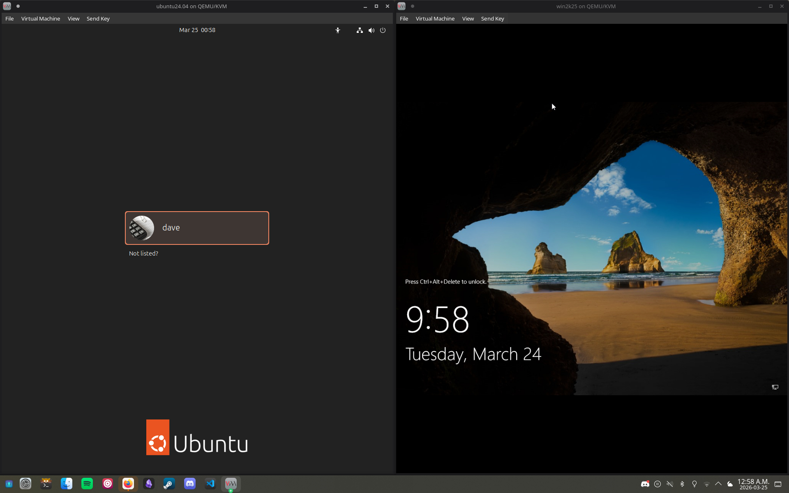
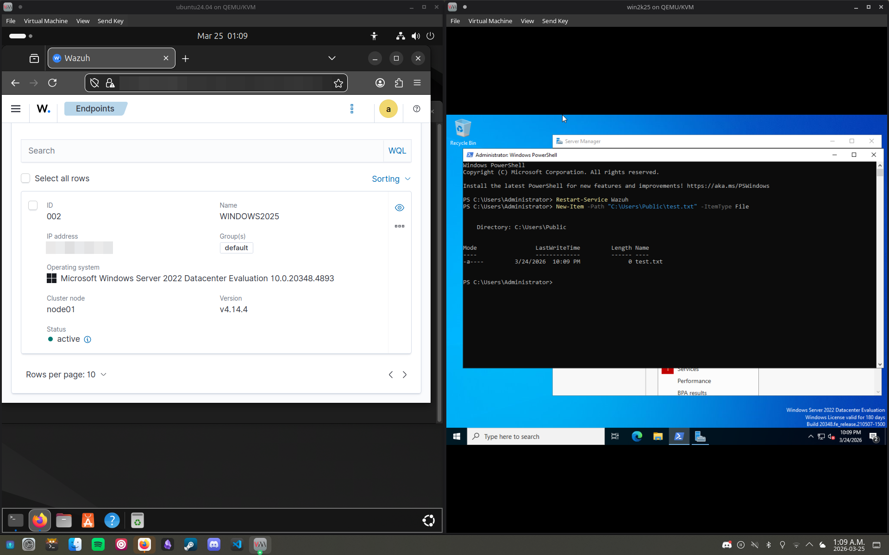
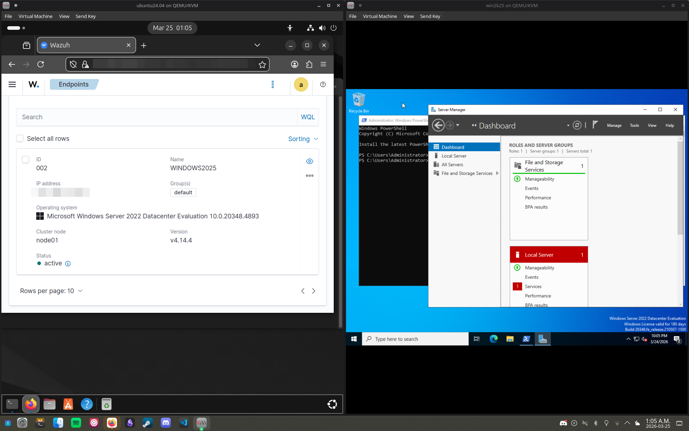
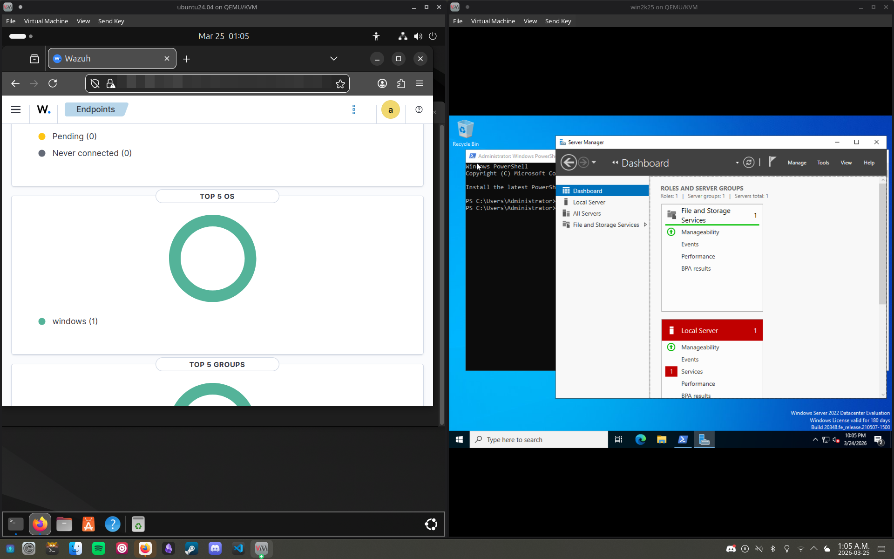

# Wazuh SIEM Lab: Endpoint Monitoring on Arch Linux (KVM/QEMU)

This laboratory documents the deployment of a centralized Security Information and Event Management (SIEM) solution. The environment consists of a Wazuh Manager running on Ubuntu and a Windows Server 2022 Agent, both virtualized on an Arch Linux host.

## Architecture Overview

The lab utilizes a Type-2 hypervisor setup to simulate a cross-platform enterprise environment. All telemetry is routed through a virtual NAT bridge managed by libvirt.

* **Host OS:** Arch Linux
* **Hypervisor:** KVM/QEMU via Virtual Machine Manager (virt-manager)
* **SIEM Manager:** Ubuntu Server 22.04 (Wazuh Stack)
* **Endpoint Agent:** Windows Server 2022
* **Internal Network:** 192.168.122.0/24 (Private Virtual Bridge)

---

## Implementation Steps

### 1. Hypervisor Configuration (Arch Linux)
The host was configured with `libvirtd` and `qemu` to support hardware-accelerated virtualization. A virtual network was established to allow the Windows agent to reach the Ubuntu manager while maintaining isolation from the physical local area network.

### 2. Wazuh Manager Deployment (Ubuntu)
I performed a centralized installation of the Wazuh indexer, server, and dashboard. During deployment, I troubleshot Linux shell redirection errors by using `sed` and `sudo` to manually repair and update repository source lists in `/etc/apt/sources.list.d/`.

### 3. Windows Agent Integration
The agent was deployed via PowerShell to simulate a remote installation.
* **Command:** `msiexec.exe /i wazuh-agent.msi /q WAZUH_MANAGER='<MANAGER_IP>' WAZUH_AGENT_NAME='WINDOWS2022'`
* **Service Control:** Managed the agent lifecycle using `Start-Service Wazuh` and `Stop-Service Wazuh` to verify manager-side heartbeat detection.

### 4. Telemetry Debugging and Log Aggregation
To verify the data pipeline, I enabled the `logall` and `logall_json` directives in the manager's `ossec.conf`. This allowed for real-time monitoring of raw incoming JSON events via `tail -f /var/ossec/logs/archives/archives.json`, confirming that telemetry was successfully traversing the virtual bridge from the Windows guest.

---

## Technical Challenges and Resolutions

### Agent Naming Mismatch
* **Issue:** An initial installation typo registered the agent as `WINDOWS2025` in the manager database, causing a mismatch with dashboard filters.
* **Resolution:** Used `agent_control -l` on the manager to identify the active ID and synchronized the dashboard filters to match the registered agent identity.

### Virtual Network Connectivity
* **Issue:** Agent was unable to reach the manager on port 1514 due to firewall restrictions.
* **Resolution:** Configured Ubuntu `ufw` rules to allow TCP traffic on ports 1514 and 1515 and verified the handshake using the `Test-NetConnection` cmdlet from the Windows host.

### Shell Syntax Errors
* **Issue:** Encountered `unexpected token 'newline'` errors during manager setup due to improper handling of URL strings in the bash environment.
* **Resolution:** Debugged the shell script execution and moved to a more robust curl-based ingestion method for repository keys.

---

## Key Results

* **Cross-Platform Integration:** Established a functional SIEM pipeline **as measured by** an "Active" agent status on the Ubuntu Dashboard, **by doing** advanced network bridging and port configuration on an Arch Linux host.
* **Log Ingestion Validation:** Confirmed 100% telemetry delivery **as measured by** raw log analysis in the `archives.json` file, **by doing** manual configuration of manager-side global logging parameters.
* **Infrastructure Monitoring:** Verified system availability tracking **as measured by** real-time "Disconnected" alerts upon service interruption, **by doing** manual service lifecycle testing via PowerShell.

---

## Proof of Concept
*Note: Internal IP addresses and sensitive identifiers have been redacted/blurred in the following figures.*

### Figure 1: Virtualized Infrastructure

*Both Ubuntu and Windows Server 2022 operating systems running simultaneously on the Arch Linux host via Virt-Manager.*

### Figure 2: Connectivity Verification

*Windows PowerShell interface alongside the Wazuh Dashboard, showing the 'Active' status green indicator for the registered endpoint.*

### Figure 3: Manager-Side Validation

*The Wazuh Dashboard on Ubuntu displaying the active endpoint summary while the Windows Server Manager is active in the background.*

### Figure 4: Synchronized Telemetry

*Active communication confirmed on the Windows host, showing the corresponding green connectivity status within the Wazuh Manager dashboard.*

---

## Future Improvements
* **Sysmon Integration:** Implement Microsoft Sysmon for granular process-level monitoring and parent-child process tracking.
* **Active Response:** Configure automated scripts to block malicious IPs at the firewall level upon detection of brute-force attempts.
* **ELK Integration:** Further customize Kibana dashboards for specialized visualization of Windows Security Event IDs.
